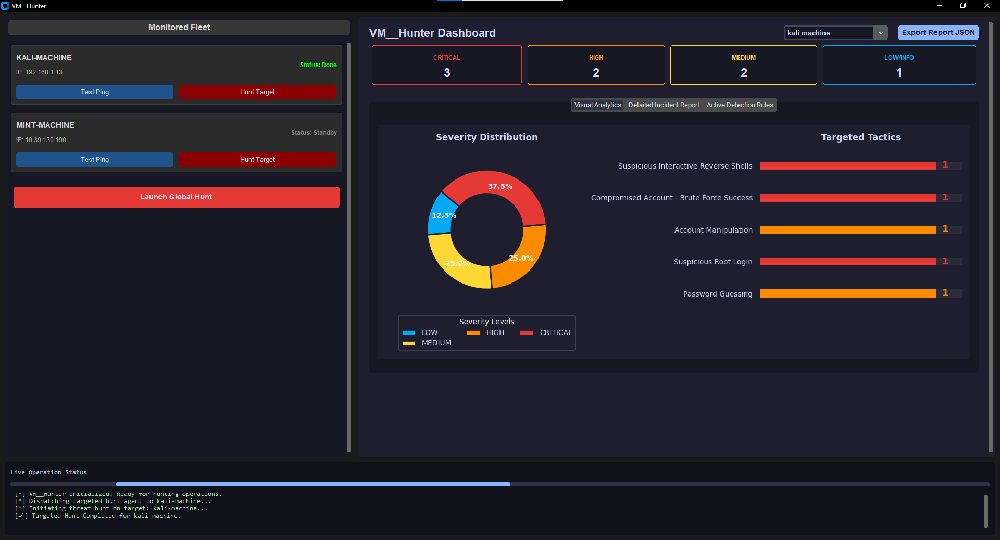
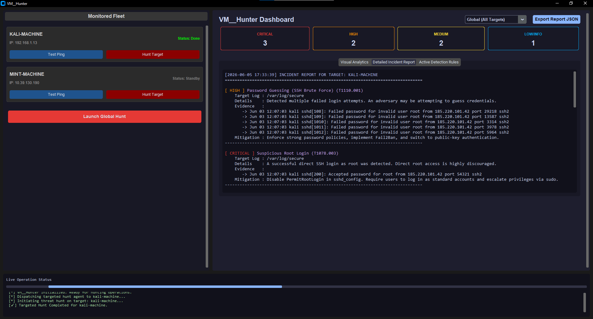

# VM_Hunter

## Overview
VM Threat Hunter is an advanced, agentless, automated Threat Hunting Tool engineered for Blue Teams and SOC Analysts. It establishes secure SSH connections to fleets of Linux-based virtual machines, dynamically retrieves critical security artifacts, and correlates them against a decoupled, rule-based detection engine mapped strictly to the MITRE ATT&CK framework.

Developed as a Capstone Project for the National Telecommunications Institute (NTI) 4-Month Scholarship, this platform demonstrates enterprise-grade software architecture, seamless UI/UX, and robust Hunt Reporting capabilities suitable for modern SOC environments.

## project structure

VM_Threat_Hunter/
│
├── main.py                  # Graphical User Interface (GUI) entry point
├── requirements.txt         # Project dependencies and libraries
├── rules.json               # Decoupled MITRE-aligned detection engine rules
├── vms.json                 # Target virtual machines configuration and credentials
│
├── gui/                     # Frontend and UI Components
│   ├── __init__.py
│   ├── app.py               # Main application window, threading, and live console
│   ├── report_panel.py      # Analytics dashboard, visual charts, and rules viewer
│   └── vm_card.py           # Individual target tracking and connection testing UI
│
├── hunting/                 # Core Detection and Correlation Engine
│   ├── __init__.py
│   ├── checks.py            # Regex pattern matching and multi-step event correlation
│   ├── engine.py            # Multi-threading task dispatching and log processing
│   └── models.py            # Dataclasses ensuring strict JSON reporting standards
│
└── transport/               # Secure Communication Layer
    ├── __init__.py
    └── ssh.py               # Fabric-based secure log fetching and remote execution


## Live Demo




## Key Features
* **Agentless Architecture:** Utilizes Python `Fabric` and `Paramiko` to establish secure SSH connections, fetching required artifacts (e.g., `/var/log/auth.log`, `/var/log/secure`, `~/.bash_history`) without installing any endpoint agents, ensuring zero footprint on target servers.
* **Dynamic Rule-Based Engine (35+ Rules):** Detection logic is completely decoupled from the application codebase using a structured `rules.json` file. It covers advanced persistent threats (APTs), fileless malware, rootkits, SUID enumeration, and defense evasion techniques.
* **Complex Event Correlation:** Detects multi-stage attacks natively, such as successful administrative logins following brute-force attempts, by maintaining state across disparate log entries.
* **Modern SOC Dashboard:** Developed with `CustomTkinter` and `Matplotlib`, the GUI features live status consoles, interactive progress tracking, KPI metrics, and dynamic donut/bar charts for visual triage.
* **Report JSON Export:** Generates highly structured, industry-standard JSON reports ready for SIEM ingestion and formal Incident Response documentation.

## Architecture Design
The application follows a strict Separation of Concerns (SoC) methodology:
1. **Transport Layer:** Connects to assets defined in `vms.json`, resolves variables like `$HOME`, and safely transfers logs to local temporary Hunting directories.
2. **Detection Engine:** Parses `rules.json`, applies highly optimized regex pattern matching, and executes behavioral correlation algorithms.
3. **Analytics UI:** A multi-threaded, non-blocking interface that renders per-machine or global analytics, allowing analysts to visually filter threats from INFO to CRITICAL severities.

## Environment Preparation & Lab Setup

To ensure seamless execution, it is critical to understand the operational environment and properly prepare the authentication channels between your machine and the remote endpoints.

### 1. Host vs. Target Architecture
* **Host Machine:** The primary workstation (your local machine running Windows, macOS, or Linux) where the `VM_Hunter` application (`main.py`) is executed.
* **Target Machines:** The remote Linux virtual machines or physical endpoints (e.g., Kali Linux, Ubuntu Server, Linux Mint) that act as the victims/servers being actively monitored and hunted.

### 2. SSH Key Configuration (Recommended)
While traditional password authentication is fully supported, configuring SSH key-based authentication is highly recommended for secure, rapid, and automated log fetching.

**On your Host Machine:**
1. Generate an SSH key pair (if you don't already have one):
   ```bash
   ssh-keygen -t rsa -b 4096

2. Copy your public key to the Target Machine to enable passwordless logins:

ssh-copy-id your_user_name@192.168.x.x

3. Test the connection to ensure it connects without prompting for a password:

ssh your_user_name@192.168.x.x


## Installation and Setup

### 1. Prerequisites
Ensure Python 3.10 or higher is installed on your system. Install the required dependencies using pip:
```bash
pip install -r requirements.txt
```

### 2. Configuration
Define your target assets in the `vms.json` file. The platform supports both password and SSH key authentication:

```json
[
  {
    "name": "kali-machine",
    "host": "192.168.x.x",
    "port": 22,
    "username": "your_user_name",
    "password": "your_password",
    "key_path": "your_key"
  }
]
```
> **Note:** Ensure you do not commit actual passwords or private keys to version control.

### 3. Execution
Launch the primary platform interface:

```bash
python main.py
```

## MITRE ATT&CK Coverage Highlights
The integrated detection engine currently evaluates target telemetry against 35+ tactics and techniques, including but not limited to:

| Technique ID | Name |
|---|---|
| T1110.001 | Password Guessing (SSH Brute Force) |
| T1078.003 | Valid Accounts (Suspicious Root Login) |
| T1548.003 | Abuse Elevation Control Mechanism (Sudo/Sudo Caching) |
| T1098.004 | Account Manipulation (SSH Authorized Keys) |
| T1070.003 | Indicator Removal on Host (Clear Command History) |
| T1562.001 | Impair Defenses (Disabling Firewalls/AppArmor) |
| T1059.004 | Command and Scripting Interpreter (Fileless Web-to-Bash Execution) |
| T1485 | Data Destruction (Ransomware Behavior) |

## Author & Copyright
**0x-7aswa** — Cybersecurity Engineer

© 2026 0x-7aswa. All Rights Reserved.
